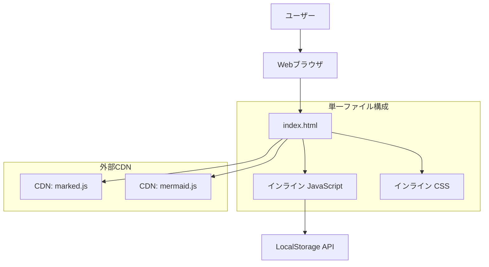

# 設計書

## 概要

マルチファイル対応マークダウンエディターは、単一のHTMLファイルで完結する静的Webアプリケーションです。複数のマークダウンファイルを管理し、ファイルごとに個別の表示設定を保持できます。CDN経由でライブラリを読み込み、ビルドプロセス不要でGitHub Pagesに直接デプロイできます。

## アーキテクチャ

### システム構成



### 技術スタック

- **構成**: 単一HTMLファイル（index.html）
- **JavaScript**: バニラJavaScript（インライン記述）
- **CSS**: インライン CSS + 印刷用メディアクエリ
- **マークダウンパーサー**: marked.js（CDN: jsDelivr）
- **図表レンダリング**: mermaid.js（CDN: jsDelivr）
- **データ保存**: Browser LocalStorage API
- **ビルドツール**: なし
- **ホスティング**: GitHub Pages（単一ファイル）

## コンポーネントとインターフェース

### HTMLレイアウト構造

```html
<!DOCTYPE html>
<html>
<head>
    <!-- メタデータとCDNライブラリ -->
</head>
<body>
    <div id="app">
        <header>
            <h1>マルチドキュメントエディター</h1>
            <div class="file-tabs">
                <div class="tab-container" id="tabContainer">
                    <!-- ファイルタブが動的に生成される -->
                </div>
                <button id="newFileBtn">+ 新規ファイル</button>
            </div>
            <div class="controls">
                <button id="settingsBtn">設定</button>
                <button id="clearBtn">クリア</button>
                <button id="printBtn">印刷</button>
                <span id="saveStatus">自動保存済み</span>
            </div>
        </header>
        
        <main class="editor-container">
            <div class="editor-panel">
                <textarea id="markdownEditor" placeholder="マークダウンでドキュメントを作成..."></textarea>
            </div>
            
            <div class="preview-panel">
                <div id="previewContent"></div>
            </div>
        </main>
    </div>
    
    <!-- 設定モーダル -->
    <div id="settingsModal" class="modal">
        <div class="modal-content">
            <h3>ファイル設定</h3>
            <div class="setting-group">
                <label>フォントサイズ</label>
                <input type="range" id="fontSizeSlider" min="12" max="24" value="14">
            </div>
            <div class="setting-group">
                <label>行間</label>
                <input type="range" id="lineHeightSlider" min="1.2" max="2.0" step="0.1" value="1.6">
            </div>
            <div class="setting-group">
                <label>フォントファミリー</label>
                <select id="fontFamilySelect">
                    <option value="system">システムフォント</option>
                    <option value="serif">セリフ</option>
                    <option value="mono">等幅フォント</option>
                </select>
            </div>
            <button id="saveSettingsBtn">保存</button>
            <button id="closeSettingsBtn">閉じる</button>
        </div>
    </div>
</body>
</html>
```

### JavaScript機能モジュール

#### 1. マルチエディターアプリケーション
```javascript
class MultiMarkdownEditor {
    constructor() {
        this.editor = document.getElementById('markdownEditor');
        this.preview = document.getElementById('previewContent');
        this.saveStatus = document.getElementById('saveStatus');
        this.tabContainer = document.getElementById('tabContainer');
        this.newFileBtn = document.getElementById('newFileBtn');
        this.settingsBtn = document.getElementById('settingsBtn');
        this.settingsModal = document.getElementById('settingsModal');
        
        this.currentFileId = null;
        this.files = new Map();
        this.fileManager = new FileManager();
        this.settingsManager = new SettingsManager();
    }
    
    init() {
        this.loadFiles();
        this.bindEvents();
        this.createDefaultFileIfNeeded();
        this.switchToFirstFile();
    }
    
    createNewFile() {
        const fileId = this.fileManager.createFile();
        this.renderTabs();
        this.switchToFile(fileId);
    }
    
    switchToFile(fileId) {
        this.saveCurrentFile();
        this.currentFileId = fileId;
        this.loadFileContent(fileId);
        this.loadFileSettings(fileId);
        this.updateActiveTab(fileId);
    }
}
```

#### 2. ファイル管理
```javascript
class FileManager {
    constructor() {
        this.storageKey = 'multi-markdown-files';
        this.metaStorageKey = 'multi-markdown-meta';
    }
    
    createFile(name = null) {
        const fileId = this.generateFileId();
        const fileName = name || this.generateFileName();
        
        const fileData = {
            id: fileId,
            name: fileName,
            content: '',
            createdAt: new Date().toISOString(),
            lastModified: new Date().toISOString()
        };
        
        this.saveFile(fileId, fileData);
        this.updateFileMeta(fileId, { name: fileName });
        return fileId;
    }
    
    saveFile(fileId, data) {
        const key = `${this.storageKey}-${fileId}`;
        localStorage.setItem(key, JSON.stringify(data));
    }
    
    loadFile(fileId) {
        const key = `${this.storageKey}-${fileId}`;
        const data = localStorage.getItem(key);
        return data ? JSON.parse(data) : null;
    }
    
    deleteFile(fileId) {
        const key = `${this.storageKey}-${fileId}`;
        localStorage.removeItem(key);
        this.removeFileMeta(fileId);
    }
    
    getAllFiles() {
        const meta = this.getFilesMeta();
        return Object.keys(meta).map(fileId => ({
            id: fileId,
            ...meta[fileId]
        }));
    }
}
```

#### 3. 設定管理
```javascript
class SettingsManager {
    constructor() {
        this.settingsStorageKey = 'multi-markdown-settings';
    }
    
    saveFileSettings(fileId, settings) {
        const key = `${this.settingsStorageKey}-${fileId}`;
        localStorage.setItem(key, JSON.stringify({
            ...settings,
            lastModified: new Date().toISOString()
        }));
    }
    
    loadFileSettings(fileId) {
        const key = `${this.settingsStorageKey}-${fileId}`;
        const data = localStorage.getItem(key);
        return data ? JSON.parse(data) : this.getDefaultSettings();
    }
    
    getDefaultSettings() {
        return {
            fontSize: 14,
            lineHeight: 1.6,
            fontFamily: 'system',
            theme: 'light'
        };
    }
    
    applySettings(settings) {
        document.documentElement.style.setProperty('--editor-font-size', `${settings.fontSize}px`);
        document.documentElement.style.setProperty('--editor-line-height', settings.lineHeight);
        document.documentElement.style.setProperty('--editor-font-family', this.getFontFamily(settings.fontFamily));
    }
}
```

#### 4. タブUI管理
```javascript
class TabManager {
    constructor(container, onTabClick, onTabClose) {
        this.container = container;
        this.onTabClick = onTabClick;
        this.onTabClose = onTabClose;
    }
    
    renderTabs(files, activeFileId) {
        this.container.innerHTML = '';
        
        files.forEach(file => {
            const tab = this.createTab(file, file.id === activeFileId);
            this.container.appendChild(tab);
        });
    }
    
    createTab(file, isActive) {
        const tab = document.createElement('div');
        tab.className = `file-tab ${isActive ? 'active' : ''}`;
        tab.dataset.fileId = file.id;
        
        const nameSpan = document.createElement('span');
        nameSpan.className = 'tab-name';
        nameSpan.textContent = file.name;
        nameSpan.addEventListener('click', () => this.onTabClick(file.id));
        
        const closeBtn = document.createElement('button');
        closeBtn.className = 'tab-close';
        closeBtn.textContent = '×';
        closeBtn.addEventListener('click', (e) => {
            e.stopPropagation();
            this.onTabClose(file.id);
        });
        
        tab.appendChild(nameSpan);
        tab.appendChild(closeBtn);
        
        return tab;
    }
}
```

## データモデル

### ファイルデータ構造
```javascript
{
    id: string,             // ファイル固有ID
    name: string,           // ファイル名
    content: string,        // マークダウンテキスト
    createdAt: string,      // 作成日時（ISO形式）
    lastModified: string,   // 最終更新日時（ISO形式）
    version: "1.0"         // データバージョン
}
```

### ファイル設定データ構造
```javascript
{
    fontSize: number,       // フォントサイズ（12-24）
    lineHeight: number,     // 行間（1.2-2.0）
    fontFamily: string,     // フォントファミリー（system/serif/mono）
    theme: string,          // テーマ（light/dark）
    lastModified: string    // 設定更新日時（ISO形式）
}
```

### ファイルメタデータ構造
```javascript
{
    [fileId]: {
        name: string,       // ファイル名
        createdAt: string,  // 作成日時
        lastAccessed: string // 最終アクセス日時
    }
}
```

### LocalStorageキー
- `multi-markdown-files-{fileId}`: 各ファイルのコンテンツ
- `multi-markdown-settings-{fileId}`: 各ファイルの設定
- `multi-markdown-meta`: ファイル一覧のメタデータ
- `multi-markdown-app-state`: アプリケーション状態（最後に開いていたファイルなど）

## エラーハンドリング

### エラー種別と対応策

#### 1. LocalStorageエラー
```javascript
function handleStorageError(error) {
    if (error.name === 'QuotaExceededError') {
        alert('ストレージ容量が不足しています。データを削除してください。');
    } else if (error.name === 'SecurityError') {
        alert('プライベートモードではデータを保存できません。');
    }
}
```

#### 2. CDNライブラリ読み込みエラー
```javascript
window.addEventListener('error', function(e) {
    if (e.target.src && e.target.src.includes('cdn')) {
        console.error('CDNライブラリの読み込みに失敗:', e.target.src);
        showFallbackMessage();
    }
});
```

#### 3. Mermaid描画エラー
```javascript
function renderMermaidSafely(element, code) {
    try {
        mermaid.render('mermaid-' + Date.now(), code, (svg) => {
            element.innerHTML = svg;
        });
    } catch (error) {
        element.innerHTML = '<pre class="mermaid-error">図表の描画に失敗しました</pre>';
    }
}
```

## テスト戦略

### 手動テスト項目

#### 基本機能テスト
1. マークダウン入力とプレビュー表示
2. 自動保存機能
3. ページリロード時のデータ復元
4. クリア機能
5. 印刷機能

#### ブラウザ互換性テスト
- Chrome（最新版）
- Firefox（最新版）
- Safari（最新版）
- Edge（最新版）

#### レスポンシブテスト
- デスクトップ（1920x1080）
- タブレット（768x1024）
- モバイル（375x667）

### 自動テスト（オプション）

#### E2Eテスト例
```javascript
// Playwright使用例
test('基本的な編集フロー', async ({ page }) => {
    await page.goto('/');
    await page.fill('#markdownEditor', '# テスト\n\nドキュメントのテストです。');
    await expect(page.locator('#previewContent h1')).toHaveText('テスト');
});
```

## パフォーマンス考慮事項

### 最適化戦略

#### 1. デバウンス処理
```javascript
function debounce(func, wait) {
    let timeout;
    return function executedFunction(...args) {
        const later = () => {
            clearTimeout(timeout);
            func(...args);
        };
        clearTimeout(timeout);
        timeout = setTimeout(later, wait);
    };
}

// プレビュー更新のデバウンス（300ms）
const debouncedUpdate = debounce(updatePreview, 300);
```

#### 2. 印刷最適化
```css
@media print {
    .editor-panel { display: none; }
    .preview-panel { width: 100%; }
    .controls { display: none; }
    
    /* ページブレーク制御 */
    h1, h2, h3 { page-break-after: avoid; }
    p, li { page-break-inside: avoid; }
}
```

#### 3. レスポンシブデザイン
```css
@media (max-width: 768px) {
    .editor-container {
        flex-direction: column;
    }
    
    .editor-panel,
    .preview-panel {
        width: 100%;
        height: 50vh;
    }
}
```

## セキュリティ考慮事項

### XSS対策
- marked.jsのサニタイズ機能を有効化
- HTMLの直接挿入を避ける
- CSPヘッダーの設定（GitHub Pages制限内で）

### プライバシー保護
- データはローカルストレージのみに保存
- 外部サーバーへの通信なし
- ユーザーデータの暗号化（オプション）

## デプロイメント

### GitHub Pages設定
1. リポジトリのSettingsでPages機能を有効化
2. ソースをmainブランチに設定
3. index.htmlをルートディレクトリに配置

### ファイル構成
```
repository-root/
├── index.html          # メインアプリケーション
├── README.md          # プロジェクト説明
└── .gitignore         # Git除外設定
```